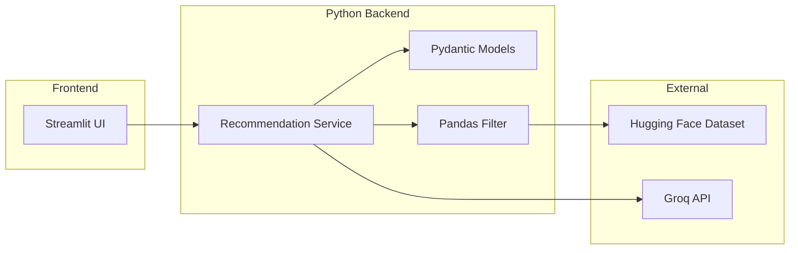
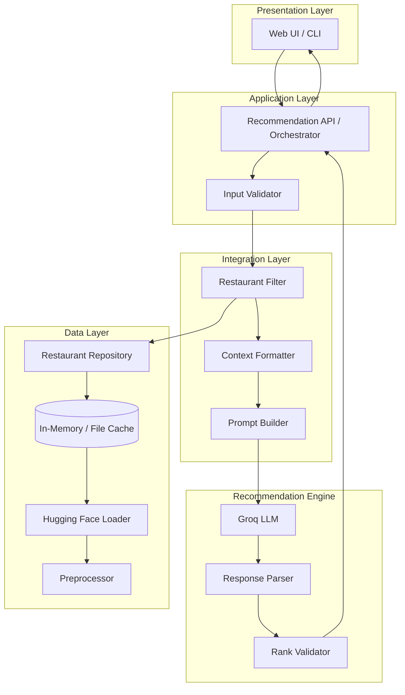
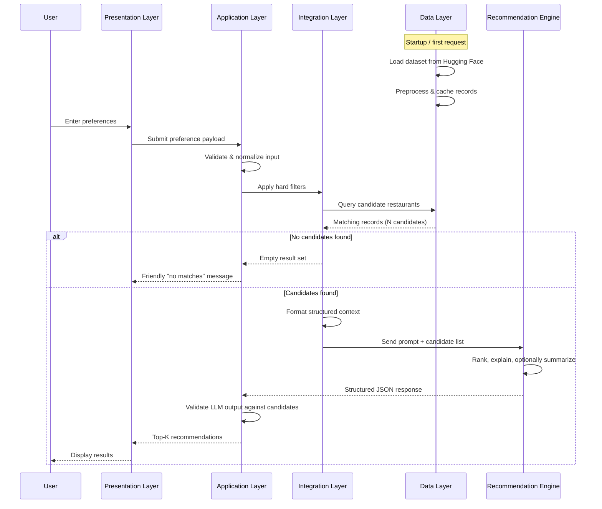
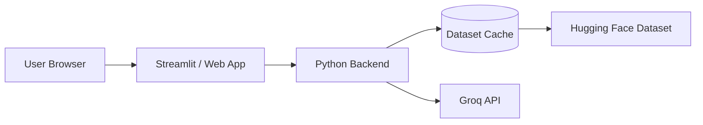

# Architecture: AI-Powered Restaurant Recommendation System

This document describes the technical architecture for the Zomato-inspired restaurant recommendation service defined in [context.md](./context.md). The system combines structured restaurant data with an LLM to deliver personalized, explainable recommendations.

---

## 1. Architecture Overview

The application follows a **layered pipeline architecture** with five logical stages:

```
┌─────────────┐    ┌─────────────┐    ┌──────────────────┐    ┌─────────────────────┐    ┌──────────────┐
│   User      │───▶│  Preference │───▶│  Integration     │───▶│  Recommendation     │───▶│   Output     │
│   Input     │    │  Validation │    │  Layer (Filter)  │    │  Engine (LLM)       │    │   Display    │
└─────────────┘    └─────────────┘    └──────────────────┘    └─────────────────────┘    └──────────────┘
                                              ▲
                                              │
                                     ┌────────┴────────┐
                                     │  Data Ingestion │
                                     │  (Hugging Face) │
                                     └─────────────────┘
```

| Layer | Responsibility |
|-------|----------------|
| **Presentation** | Collect preferences, render recommendations |
| **Application** | Orchestrate workflow, validate input, handle errors |
| **Integration** | Filter dataset, build LLM context, manage prompts |
| **Recommendation** | LLM ranking, explanation generation, optional summary |
| **Data** | Load, preprocess, cache, and query restaurant records |

### Design Principles

1. **Grounded recommendations** — The LLM only ranks and explains restaurants from a pre-filtered candidate set; it does not invent new entries.
2. **Separation of concerns** — Deterministic filtering handles hard constraints (location, min rating, budget); the LLM handles soft preferences and natural-language reasoning.
3. **Structured I/O** — User input and LLM output use defined schemas to reduce parsing errors and hallucination.
4. **Progressive enhancement** — The system works with filtered data alone; LLM adds ranking quality and explanations.

---

## 2. Technology Stack

### Stack Summary

| Layer | Technology | Purpose |
|-------|------------|---------|
| **Language** | Python 3.10+ | Core application runtime |
| **LLM** | [Groq](https://console.groq.com/) | Fast inference for ranking & explanations |
| **LLM SDK** | `groq` (official Python client) | Chat completions API integration |
| **Dataset** | Hugging Face `datasets` | Load Zomato restaurant dataset |
| **Data Processing** | `pandas` | Cleaning, filtering, normalization |
| **Data Validation** | `pydantic` | Typed models for input/output schemas |
| **UI** | `streamlit` | Interactive web interface (MVP) |
| **Configuration** | `python-dotenv` | Environment variable management |
| **Testing** | `pytest` | Unit and integration tests |
| **Logging** | Python `logging` | Pipeline and error observability |

### Why Groq?

Groq provides **ultra-low-latency** inference for open-source models, making it ideal for interactive recommendation flows where users expect sub-second LLM responses after filtering.

| Advantage | Benefit for this project |
|-----------|--------------------------|
| High throughput | Fast ranking of 20 candidates with explanations |
| OpenAI-compatible API | Easy migration; optional use of `openai` SDK with Groq base URL |
| Cost-effective | Free tier available; pay-per-token pricing on production models |
| Strong open models | Llama 3.x models handle structured JSON ranking well |

### Groq Model Selection

| Model ID | Role | When to Use |
|----------|------|-------------|
| `llama-3.3-70b-versatile` | **Primary** | Ranking, reasoning, personalized explanations |
| `llama-3.1-8b-instant` | **Fallback** | Faster responses; simpler queries or dev/testing |

**Recommended default:** `llama-3.3-70b-versatile` — best balance of reasoning quality and speed for multi-restaurant ranking with explanations.

### Dependencies (`requirements.txt`)

```
python-dotenv>=1.0.0
groq>=0.13.0
datasets>=3.0.0
pandas>=2.0.0
pydantic>=2.0.0
streamlit>=1.30.0
pytest>=8.0.0
```

### Groq Integration Pattern

```python
import os
import json
from groq import Groq

client = Groq(api_key=os.environ["GROQ_API_KEY"])

response = client.chat.completions.create(
    model=os.environ.get("GROQ_MODEL", "llama-3.3-70b-versatile"),
    messages=[
        {"role": "system", "content": system_prompt},
        {"role": "user", "content": user_prompt},
    ],
    temperature=0.3,
    response_format={"type": "json_object"},
)

result = json.loads(response.choices[0].message.content)
```

> **Note:** Use `temperature=0.3` for consistent ranking. Request JSON output via prompt instructions; Groq supports `response_format={"type": "json_object"}` on supported models for reliable structured parsing.

### Architecture ↔ Stack Mapping



---

## 3. High-Level Component Diagram



---

## 4. End-to-End Data Flow



---

## 5. Layer-by-Layer Design

### 5.1 Data Ingestion Layer

**Purpose:** Load the Zomato dataset once, normalize it, and make it queryable.

| Component | Description |
|-----------|-------------|
| **Dataset Loader** | Fetches `ManikaSaini/zomato-restaurant-recommendation` via `datasets` library |
| **Preprocessor** | Cleans nulls, normalizes text fields, maps cost to budget tiers |
| **Cache** | Stores processed records in memory (or Parquet/JSON on disk) to avoid repeated downloads |
| **Restaurant Repository** | Provides query interface: filter by location, cuisine, rating, budget |

#### Expected Dataset Fields (to be confirmed on load)

Based on typical Zomato datasets and project requirements:

| Field | Usage |
|-------|-------|
| `name` / `restaurant_name` | Display, LLM context |
| `location` / `city` / `address` | Hard filter by user location |
| `cuisines` | Hard/soft filter, display |
| `rate` / `rating` | Min rating filter, ranking signal |
| `approx_cost(for two people)` / `price_range` | Budget tier mapping |
| `votes` | Tie-breaker for popularity |
| `rest_type` / `dish_liked` | Optional enrichment for LLM context |

#### Preprocessing Steps

1. **Load** — `load_dataset("ManikaSaini/zomato-restaurant-recommendation")`
2. **Normalize location** — Lowercase, strip whitespace, map aliases (e.g., "Bengaluru" → "Bangalore")
3. **Parse cuisines** — Split comma-separated strings into lists
4. **Map budget tiers** — Convert numeric cost to `low` / `medium` / `high` buckets
5. **Handle missing ratings** — Exclude or default based on business rule
6. **Deduplicate** — Remove duplicate name + location pairs if present
7. **Index** — Build lookup structures for fast filtering

#### Budget Tier Mapping (example)

| Tier | Approx. Cost for Two (INR) |
|------|----------------------------|
| Low | ≤ 500 |
| Medium | 501 – 1500 |
| High | > 1500 |

*(Thresholds should be calibrated after inspecting actual dataset distribution.)*

---

### 5.2 User Input Layer

**Purpose:** Collect and validate user preferences before filtering.

#### Input Schema

```json
{
  "location": "Bangalore",
  "budget": "medium",
  "cuisine": "Italian",
  "min_rating": 4.0,
  "additional_preferences": "family-friendly, quick service"
}
```

| Field | Type | Required | Validation |
|-------|------|----------|------------|
| `location` | string | Yes | Non-empty; must match known cities in dataset |
| `budget` | enum | Yes | One of: `low`, `medium`, `high` |
| `cuisine` | string | No | Fuzzy match against dataset cuisine list |
| `min_rating` | float | No | Range 0.0 – 5.0 |
| `additional_preferences` | string | No | Free text; passed to LLM for soft matching |

#### Validation Rules

- Reject unknown locations with a list of supported cities
- Default `min_rating` to 0 if not provided
- Trim and sanitize free-text fields
- Cap `additional_preferences` length (e.g., 500 chars) to control prompt size

---

### 5.3 Integration Layer

**Purpose:** Bridge structured data and the LLM — filter candidates, format context, build prompts.

#### Restaurant Filter

Applies **deterministic hard filters** before LLM invocation:

```
ALL records
  → filter by location (exact or fuzzy match)
  → filter by min_rating
  → filter by budget tier
  → filter by cuisine (if specified)
  → limit to top N candidates (e.g., 20) by rating + votes
  → output candidate list
```

| Filter | Strategy |
|--------|----------|
| Location | Case-insensitive match on city/location field |
| Rating | `rating >= min_rating` |
| Budget | Match mapped tier against user selection |
| Cuisine | Substring or token match in cuisines field |
| Candidate cap | Prevents LLM context overflow; keeps best N by rating |

#### Context Formatter

Converts filtered records into a compact, LLM-readable structure:

```json
[
  {
    "id": 1,
    "name": "Truffles",
    "cuisine": "Italian, Continental",
    "rating": 4.5,
    "cost_for_two": 800,
    "budget_tier": "medium",
    "location": "Bangalore"
  }
]
```

#### Prompt Builder

Constructs a system + user prompt with:

- **System message** — Role, constraints, output format (JSON schema)
- **User message** — User preferences + candidate list + ranking instructions

Key prompt constraints:

- Rank only from the provided candidate list
- Do not invent restaurants
- Return structured JSON with rank, explanation per restaurant
- Reference specific user preferences in explanations

---

### 5.4 Recommendation Engine (Groq LLM)

**Purpose:** Rank filtered candidates and generate human-like explanations using **Groq**.

#### Responsibilities

| Task | Owner |
|------|-------|
| Hard constraint filtering | Integration Layer (deterministic) |
| Soft preference matching | Groq LLM (family-friendly, quick service) |
| Ranking | Groq LLM |
| Per-restaurant explanation | Groq LLM |
| Optional summary | Groq LLM |

#### Groq Configuration

| Setting | Value |
|---------|-------|
| **Provider** | [Groq Cloud](https://console.groq.com/) |
| **SDK** | `groq` Python library |
| **Primary model** | `llama-3.3-70b-versatile` |
| **Fallback model** | `llama-3.1-8b-instant` |
| **Temperature** | `0.3` (consistent ranking) |
| **Max tokens** | `2048` (sufficient for top-5 + summary) |
| **Output format** | JSON object via prompt + `response_format` |

#### Groq Service Implementation (`llm_service.py`)

```python
from groq import Groq
from groq import APIError, RateLimitError

class GroqLLMService:
    def __init__(self, api_key: str, model: str = "llama-3.3-70b-versatile"):
        self.client = Groq(api_key=api_key)
        self.model = model

    def get_recommendations(self, system_prompt: str, user_prompt: str) -> dict:
        try:
            response = self.client.chat.completions.create(
                model=self.model,
                messages=[
                    {"role": "system", "content": system_prompt},
                    {"role": "user", "content": user_prompt},
                ],
                temperature=0.3,
                max_tokens=2048,
                response_format={"type": "json_object"},
            )
            return json.loads(response.choices[0].message.content)
        except RateLimitError:
            # Retry with fallback model or exponential backoff
            raise
        except APIError:
            # Fall back to rating-sorted candidates without explanations
            raise
```

#### Expected LLM Output Schema

```json
{
  "summary": "Based on your preference for Italian food in Bangalore with a medium budget...",
  "recommendations": [
    {
      "id": 1,
      "rank": 1,
      "name": "Truffles",
      "cuisine": "Italian, Continental",
      "rating": 4.5,
      "estimated_cost": 800,
      "explanation": "Highly rated Italian spot within your budget, known for quick service..."
    }
  ]
}
```

#### Post-LLM Validation (Rank Validator)

1. Verify every returned `id` exists in the candidate set
2. Reject hallucinated restaurant names not in candidates
3. Enforce top-K limit (e.g., 5 recommendations)
4. Fall back to rating-sorted list if LLM response is malformed

---

### 5.5 Output Display Layer

**Purpose:** Present recommendations in a clear, user-friendly format.

#### Display Fields (per recommendation)

| Field | Source |
|-------|--------|
| Restaurant Name | Dataset (validated by LLM) |
| Cuisine | Dataset |
| Rating | Dataset |
| Estimated Cost | Dataset |
| AI Explanation | LLM-generated |
| Rank | LLM-assigned |

#### UI Options

| Option | Pros | Cons |
|--------|------|------|
| **Streamlit** | Fast to build, Python-native | Less customizable |
| **Gradio** | Simple ML demo UI | Limited layout control |
| **React + FastAPI** | Production-ready, flexible | More setup |
| **CLI** | Good for testing / scripts | No visual polish |

**Recommended for MVP:** **Streamlit** front-end with a Python backend orchestrator (aligned with tech stack in Section 2).

---

## 6. Proposed Project Structure

```
zomato-restaurant-suggestion/
├── context.md
├── architecture.md
├── requirements.txt
├── .env.example
├── README.md
│
├── src/
│   ├── __init__.py
│   ├── main.py                    # Entry point (CLI or app launcher)
│   │
│   ├── data/
│   │   ├── __init__.py
│   │   ├── loader.py              # Hugging Face dataset loader
│   │   ├── preprocessor.py        # Cleaning, normalization, budget mapping
│   │   └── repository.py          # Query/filter interface
│   │
│   ├── models/
│   │   ├── __init__.py
│   │   ├── user_preferences.py    # Pydantic model for input
│   │   ├── restaurant.py          # Restaurant record model
│   │   └── recommendation.py      # LLM output model
│   │
│   ├── services/
│   │   ├── __init__.py
│   │   ├── filter_service.py      # Hard filter logic
│   │   ├── recommendation_service.py  # Orchestrates full pipeline
│   │   └── llm_service.py         # Groq API calls, retry, JSON parsing
│   │
│   ├── prompts/
│   │   ├── __init__.py
│   │   ├── system_prompt.txt
│   │   └── user_prompt_template.txt
│   │
│   └── ui/
│       ├── __init__.py
│       └── app.py                 # Streamlit / Gradio UI
│
├── tests/
│   ├── test_preprocessor.py
│   ├── test_filter_service.py
│   └── test_llm_service.py
│
└── Docs/
    └── problemstatement.txt
```

---

## 7. Core Data Models

### UserPreferences

```python
class UserPreferences(BaseModel):
    location: str
    budget: Literal["low", "medium", "high"]
    cuisine: Optional[str] = None
    min_rating: float = Field(default=0.0, ge=0.0, le=5.0)
    additional_preferences: Optional[str] = None
```

### Restaurant

```python
class Restaurant(BaseModel):
    id: int
    name: str
    location: str
    cuisines: str
    rating: float
    cost_for_two: Optional[int] = None
    budget_tier: Literal["low", "medium", "high"]
    votes: Optional[int] = None
```

### Recommendation

```python
class Recommendation(BaseModel):
    id: int
    rank: int
    name: str
    cuisine: str
    rating: float
    estimated_cost: Optional[int] = None
    explanation: str

class RecommendationResponse(BaseModel):
    summary: Optional[str] = None
    recommendations: list[Recommendation]
```

---

## 8. Prompt Engineering Strategy

### System Prompt (guidelines)

- You are a restaurant recommendation assistant for Zomato-style dining suggestions in India.
- You receive a list of real restaurants and user preferences.
- Rank and explain only from the provided list — never invent restaurants.
- Return valid JSON matching the specified schema.
- Explanations should reference specific user preferences (location, budget, cuisine, additional notes).

### User Prompt Template (structure)

```
User Preferences:
- Location: {location}
- Budget: {budget}
- Cuisine: {cuisine}
- Minimum Rating: {min_rating}
- Additional Preferences: {additional_preferences}

Candidate Restaurants:
{candidate_json}

Task:
1. Rank the top 5 restaurants that best match the user's preferences.
2. For each, provide a concise explanation (1-2 sentences) referencing why it fits.
3. Optionally provide a brief overall summary.
4. Return JSON only.
```

### Prompt Design Considerations

| Concern | Mitigation |
|---------|------------|
| Context length | Cap candidates at ~20 records; use compact JSON |
| Hallucination | Explicit constraint + post-validation |
| Inconsistent format | Request JSON schema; use structured output / function calling |
| Latency | Use smaller model for MVP; cache dataset, not LLM calls |
| Cost | Limit tokens; batch candidate info compactly |

---

## 9. Error Handling & Edge Cases

| Scenario | Handling |
|----------|----------|
| Dataset download fails | Retry with backoff; show cached copy if available |
| No restaurants match filters | Return friendly message; suggest relaxing constraints |
| LLM API timeout / error | Retry once; fall back to `llama-3.1-8b-instant`; then rating-sorted list without explanations |
| Malformed LLM JSON | Parse with fallback; re-prompt or use deterministic ranking |
| Unknown location | Return list of valid cities from dataset |
| Empty cuisine match | Broaden to all cuisines in location; inform user |
| Groq rate limiting | Exponential backoff; switch to fallback model |

---

## 10. Non-Functional Requirements

| Requirement | Target |
|-------------|--------|
| **Latency** | < 3s end-to-end with Groq (excluding first-time dataset load) |
| **Dataset load** | One-time ~30–60s; cached thereafter |
| **Availability** | Graceful degradation if LLM unavailable |
| **Scalability** | Single-user MVP; repository pattern allows DB swap later |
| **Maintainability** | Modular layers; prompts externalized as templates |
| **Testability** | Filter/preprocess unit tests; mock LLM for integration tests |

---

## 11. Security & Configuration

| Item | Approach |
|------|----------|
| API keys | Store in `.env`; never commit secrets |
| Input sanitization | Validate all user fields; limit string lengths |
| LLM data privacy | Send only necessary restaurant fields; no PII |
| Dependencies | Pin versions in `requirements.txt` |

#### Environment Variables

```
GROQ_API_KEY=              # Get from https://console.groq.com/keys
GROQ_MODEL=llama-3.3-70b-versatile
GROQ_FALLBACK_MODEL=llama-3.1-8b-instant
MAX_CANDIDATES=20
TOP_K_RECOMMENDATIONS=5
DATASET_CACHE_PATH=./data/cache
```

---

## 12. Deployment Architecture (Future)



| Stage | Deployment |
|-------|------------|
| **MVP** | Local Streamlit app, in-memory cache |
| **Demo** | Streamlit Cloud / Hugging Face Spaces |
| **Production** | FastAPI backend + React frontend + Redis cache + Groq API |

---

## 13. Implementation Phases

### Phase 1 — Data Foundation
- Load and explore Hugging Face dataset
- Implement preprocessor and repository
- Confirm field names and budget tier thresholds

### Phase 2 — Filtering Pipeline
- Implement `UserPreferences` validation
- Build deterministic filter service
- Unit test filter combinations

### Phase 3 — Groq LLM Integration
- Design and iterate on prompts
- Implement `GroqLLMService` with JSON structured output
- Add response validation and fallback to `llama-3.1-8b-instant`

### Phase 4 — UI & Orchestration
- Build Streamlit/Gradio interface
- Wire full pipeline in recommendation service
- Display ranked results with explanations

### Phase 5 — Hardening
- Error handling, edge cases, logging
- Performance tuning (caching, candidate limits)
- Documentation and demo deployment

---

## 14. Success Criteria (from Context)

- Recommendations are grounded in real dataset entries — enforced by filter + LLM validation
- User preferences meaningfully influence results — hard filters + soft LLM matching
- LLM output is personalized and explains *why* each restaurant fits
- Results display name, cuisine, rating, cost, and AI explanation clearly

---

## 15. Open Questions

| Question | Action |
|----------|--------|
| Exact dataset column names? | Inspect dataset on first load; update models |
| Budget tier thresholds? | Analyze cost distribution in dataset |
| Groq model fine-tuning? | Start with `llama-3.3-70b-versatile`; benchmark vs `llama-3.1-8b-instant` |
| Supported cities list? | Derive dynamically from dataset locations |
